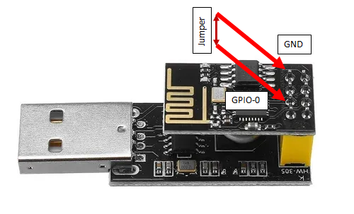

# ESP-01S-Relay-v4.0

## ON, OFF and PULSE configuration

This is an Arduino Sketch prepared to control the relay on the ESP-01S-Relay-v4.0 board.

### Tools

Name | Image | Info
-----|-------| -----
ESP-01S |  | -
Relay board v4.0 |  | -
USB converter |  | USB-UART CH340 chip drivers ([Windows](http://www.wch-ic.com//download/CH341SER_ZIP.html))

## How to use

1. Install the USB-UART driver for the CH340 chip
2. In the Arduino IDE, go to 'Boards Manager' and download 'Generic ESP8266 Module'
3. Configure it to 115200 'Upload speed'
4. Connect the 'ESP-01S' connected to the 'USB converter'. Attention!: The GPIO-0 must be grounded when connecting the USB. You can connect a jumper in the board if necessary.

5. Download the Arduino sketch
6. Connect the ESP-01S in the Relay board

7. It is ready to use!

## Issues

- The default firmware loaded to the 'Relay board v4.0' usually trigger the relay when it is powered on. It is possible to workaround it adding a capacitor to the optocoupler presented in the relay board.

(from [Amaktronix](https://github.com/IOT-MCU/ESP-01S-Relay-v4.0/issues/1#issuecomment-562799267))

(from [amitofile](https://github.com/IOT-MCU/ESP-01S-Relay-v4.0/issues/1#issuecomment-680735425))
